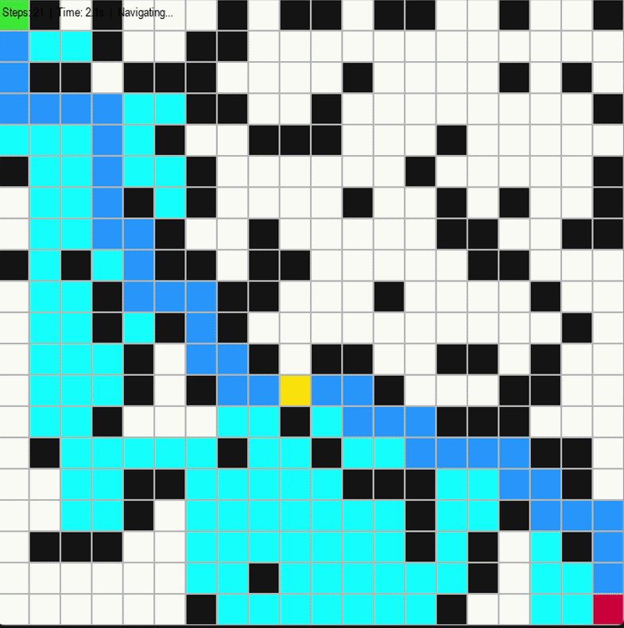
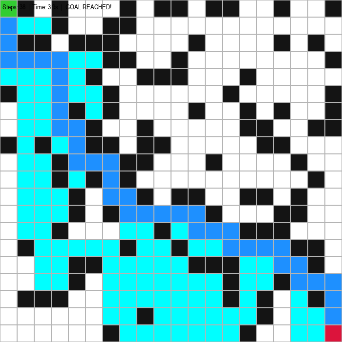

# 🚗 AI-Based Autonomous Navigation System

## 📖 Overview
This project demonstrates an AI-based autonomous navigation system using Python. It simulates how an intelligent agent navigates from a start point to a goal while avoiding obstacles using path planning algorithms.

---

## 🎯 Features
- A* Path Planning Algorithm
- Grid-based Simulation Environment
- Obstacle Avoidance
- Modular Code Architecture
- Performance Logging & Analysis

---

## 🛠️ Tech Stack
- Python
- NumPy
- OpenCV
- Matplotlib
- PyGame

---

## 🧠 System Architecture
1. Environment/Grid Creation
2. Path Planning (A* Algorithm)
3. Agent Navigation
4. Simulation Execution
5. Output Visualization

---

## Output

## 👨‍💻 Author
Tufan Chowdhury
## ▶️ How to Run

```bash
git clone https://github.com/tufan2416/ai-autonomous-navigation-system.git
cd ai-autonomous-navigation-system
pip install -r requirements.txt
python main.py
